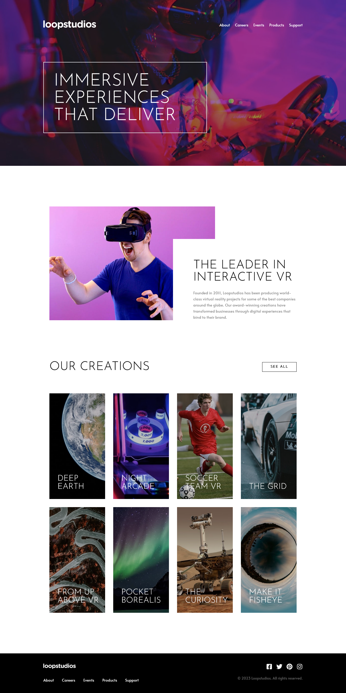

# Frontend Mentor - Loopstudios landing page solution

This is a solution to the [Loopstudios landing page on Frontend Mentor](https://www.frontendmentor.io/challenges/loopstudios-landing-page-N88J5Onjw/). Frontend Mentor challenges help you improve your coding skills by building realistic projects.

### Screenshot

### Links

- Solution URL: [Github](https://github.com/Adel-Harrat/fm-junior-loopstudios-landing-page)
- Live Site URL: [Vercel](https://fm-junior-loopstudios-landing-page.vercel.app/)

## My process

### Built with

- Semantic HTML5 markup
- Accessibility in mind
- Best code practices ✔
- Flexbox
- CSS Grid
- Mobile-first workflow
- Tailwind merge plugin
- Tailwind auto sorting plugin
- [TailwindCSS](https://tailwindcss.com/) - CSS framework
- [React](https://reactjs.org/) - JS library
